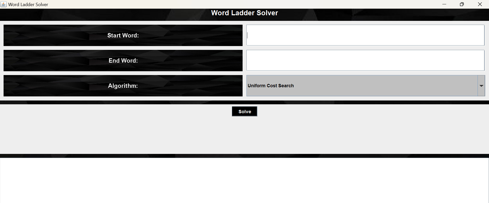

# Penyelesaian Permainan Word Ladder Menggunakan Algoritma UCS, Greedy Best First Search, dan A*
Tugas Kecil 3 Mata Kuliah IF2211 Strategi Algoritma 2023

## **Table of Contents**
* [General Information](#general-information)
* [Requirements](#requirements)
* [How to Run and Compile (Windows)](#how-to-run-and-compile-windows)
* [Screenshot](#screenshot)
* [Program Structure](#program-structure)
* [Authors](#authors)

## **General Information**
>Python program that finds the shortest path between two points on a map using two popular graph search algorithms - Uniform Cost Search (UCS) and A* Algorithm. The program takes a map as input, represented as a weighted graph, and applies the selected algorithm to find the shortest path from a source point to a destination point.

## **Requirements**
To use this program, you will need to install **Java** (https://www.oracle.com/id/java/technologies/downloads/) on the device you are using. 

## **How to Run and Compile (Windows)**
### **Setup**
1. Clone this repository <br>
```sh 
$ git clone git@github.com:Andhikafdh/Tucil3_13522128.git
```
2. Open this repository in terminal

### **Run**
1. Change the directory to the 'src' folder <br>
```sh 
$ cd src
```

2. Compile program <br>
```sh 
$ javac *.java
```

3. Run program <br>
```sh 
$ java Main.java
```

## **Screenshot**

 


## **Program Structure**
```
.
 ┣ doc
 ┃ ┗ Tucil 3_K3_13522128
 ┣ src
 ┃ ┣ AStar.java
 ┃ ┣ GBFS.java
 ┃ ┣ UCS.java
 ┃ ┣ Main.java
 ┃ ┣ WordLadderSolverGUI.java
 ┃ 
 ┣ test
 ┃ ┣ astar_testcase
 ┃ ┣ gbfs_testcase
 ┃ ┣ ucs_testcase
 ┃ 
 ┗ README.md
```

## **Authors**

| **NIM**  |       **Name**        | **Class**  |       
| :------: | :-------------------: | :------:   | 
| 13522128 |    Mohammad Andhika Fadillah   | K03
